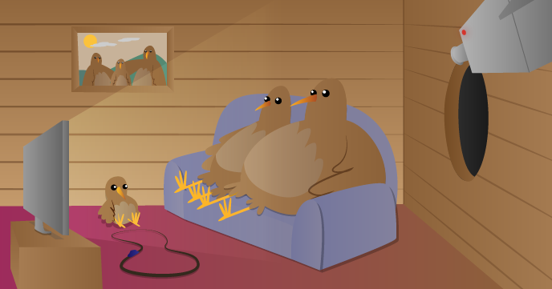

# Infrared Bird Box

A bird box with a Raspberry Pi infrared camera inside.

This project will not only teach you about electronics and programming, but can help support the bird population in your area. Having a camera inside a nesting box can be tremendously rewarding; however, with the Raspberry Pi you can also share the nesting box with the world by streaming the video content to the internet. Watch as your birds gain their own internet following!

[Worksheet](https://github.com/raspberrypilearning/infrared-bird-box/blob/master/worksheet.md)

## Licence

Unless otherwise specified, everything in this repository is covered by the following licence:

***Infrared Bird Box*** by the [Raspberry Pi Foundation](http://raspberrypi.org) is licenced under a [Creative Commons Attribution 4.0 International License](http://creativecommons.org/licenses/by-sa/4.0/).

Based on a work at https://github.com/raspberrypilearning/infrared-bird-box
