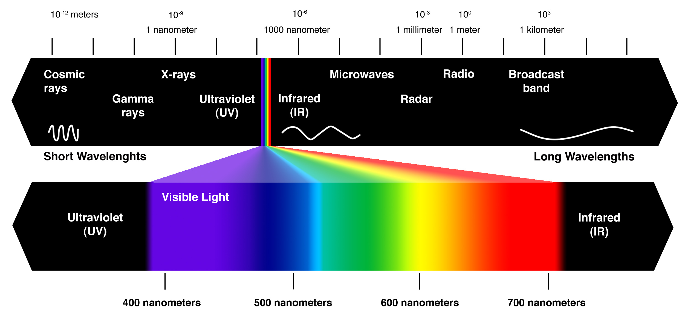
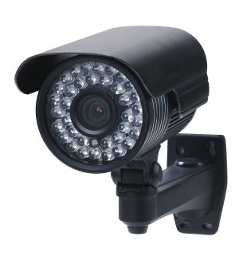
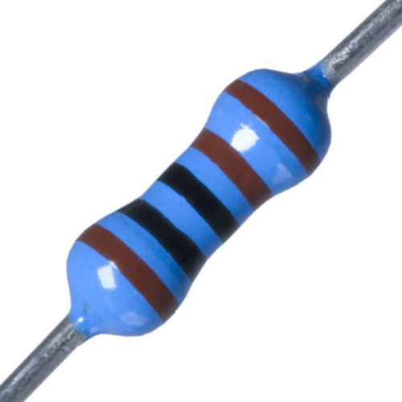
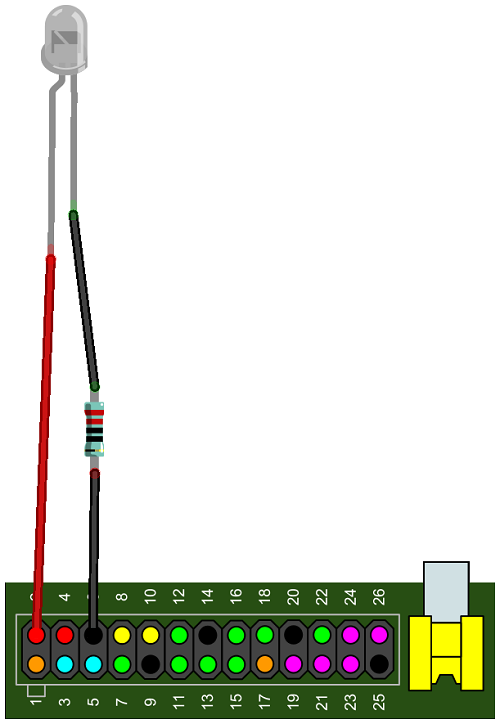
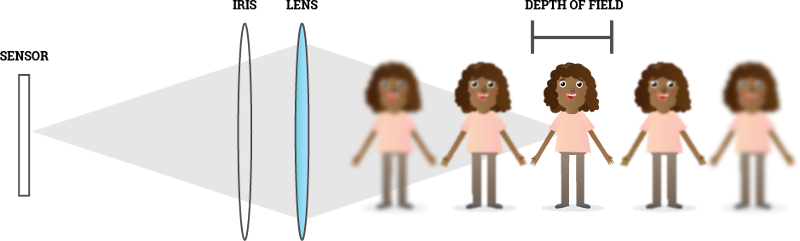
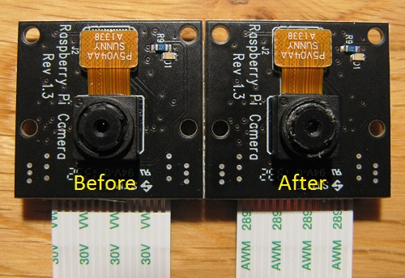
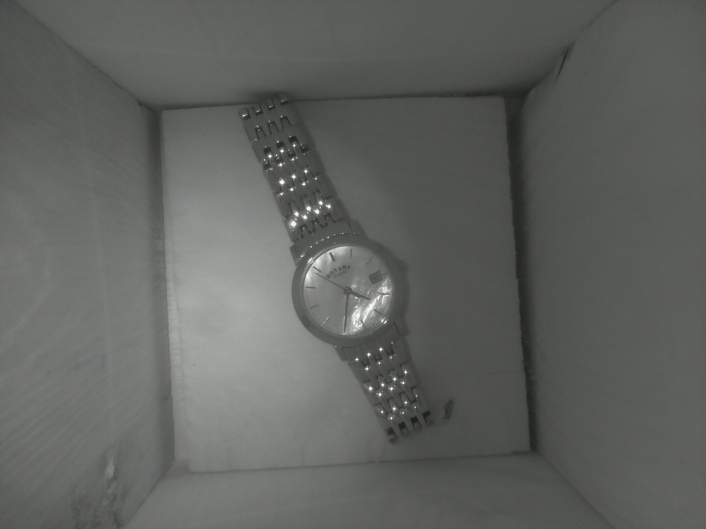
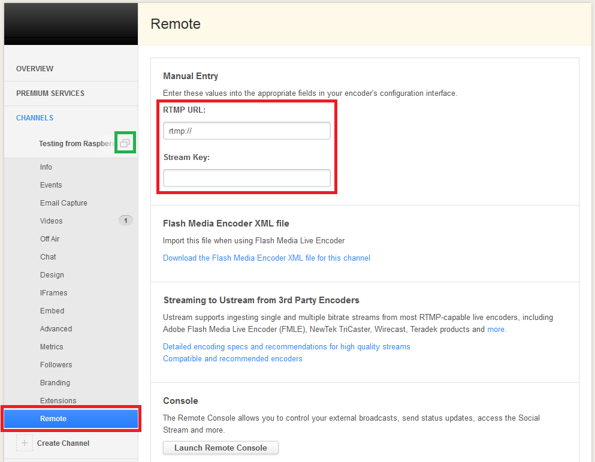

##Introduction

To begin with, pupils should appreciate that garden birds are very choosy about where they build their nest. The bird box will need to be located out of any predator's reach, away from any prevailing winds and nowhere near a bird table or feeder.

Once a bird has moved in, the box must not be disturbed until they have finished breeding; this is usually between October and January in the UK. If something goes wrong you can't just open the box and fiddle with your wires or adjust the camera, as this will traumatise the birds and could cause eggs or hatchlings to be abandoned.

A requirement of the system is to see the birds in total darkness. A light inside the bird box could attract insects and predators, and therefore no birds would select it as a nesting site. It is possible, however, to illuminate the inside of the bird box with a kind of light that is invisible to animals and humans, but *is* visible to a camera. This is commonly known as night vision. Night vision works by using a spectrum of light called [Infrared](http://en.wikipedia.org/wiki/Infrared) which has a longer wavelength than visible light. Notice that IR is to the right hand side of the visible spectrum of light below:



Look at the night vision surveillance camera below, for example. Around the camera lens, there are lots of infrared LEDs (light emitting diodes). These emit infrared light which will then bounce off various objects and return to the camera lens, allowing it to create an image.



The image will look black and white (greyscale) because there are no wavelengths of light from the visible spectrum being detected. However, a black and white image is good enough to allow you to watch what is happening inside a bird box, and it doesn't disturb or interfere with the birds in any way.


Pictured above is the special version of the Raspberry Pi camera board called Pi NoIR. It's essentially identical to the normal green camera but it has no infrared filter, meaning that it lets in infrared light. This camera, combined with an infrared light source, will give you night vision. It's also small and won't be too intrusive when mounted on the inside of a bird box.

## Step 0: Setting Up your Pi

First check that you have all the parts you need to get your Raspberry Pi set up and working.

- Raspberry Pi
- Micro USB power adaptor
- An SD card with Raspbian already set up through NOOBS
- USB keyboard
- USB mouse
- HDMI cable
- A monitor or TV

### Activity Checklist:

1. Place the SD card into the slot of your Raspberry Pi. It will only fit one way so be careful not to break the card.
2. Next connect the HDMI cable from the monitor (or TV) to the HDMI port on the Pi and turn on your monitor.
3. Plug the USB keyboard and mouse into the USB ports on the Pi.
4. Plug in the micro USB power supply and you should see some text appear on your screen.
5. When prompted to login type:

    ```bash
    Login: pi
    Password: raspberry
    ```

## Step 1: Setting up the Camera Board

Firstly, set up the Pi NoIR camera board without touching the bird box. Test it first, and we'll come to putting everything into the bird box later on. Follow the official instructions [here](http://www.raspberrypi.org/camera) and stop once you have successfully used a few of the example commands.

If you have not done so already you can test the camera video preview using the following command:

```bash
raspivid -t 0
```

You'll notice that everything looks a little strange. This is because you're looking at a combination of visible light and infrared light. A quick test is to turn the lights off, aim a TV remote control at your face and press the buttons. You should see your face illuminated in the darkness!

Press `Ctrl + C` when you want to exit.

## Step 2: Wiring up the Infrared LED

The intention is to have a single infrared LED illuminating the inside of the bird box, to allow the Pi NoIR camera to see something. The 890nm IR LED is an identical component to the ones found inside TV remote controls. The only difference is that we're going to keep it on constantly to facilitate the live stream.

First check that you have all the required parts to do this:

- **Female** to **Female** jumper wires, at least 3
- 220 Ohm Resistor
- Infrared LED 5mm 890nm

You should do this with the Raspberry Pi turned off and unplugged from the mains for safety. Use the following command to shut down the Pi:

```bash
sudo halt
```

Wait for the ACT (activity) LED to stop blinking before turning off the power.

If you've wired up an LED to the Pi GPIO pins before, then please note that *this- LED needs to be done slightly differently. An infrared LED requires more current than the general purpose pins can provide. It needs to be connected directly to the 5 volt supply of the Raspberry Pi with a 220 ohm resistor inline; without the resistor the current will be too high, and the LED will burn out after about ten seconds.

Ensure that you have the correct type of resistor; it needs to be 220 ohms *not- 220K ohms (220 thousand). The 5 band resistor colour code is red - red - black - black - brown. Please refer to the [electronic colour code](http://en.wikipedia.org/wiki/Electronic_color_code) system for further guidance. This is what the resistor should look like:



The diagram below shows how the LED should be wired up. You'll notice that the LED has two legs, one slightly longer than the other. The longer of the two is called the **anode** and the shorter is the **cathode**. The LED needs power to flow into the anode and out of the cathode; if you get the polarity wrong then nothing will happen.

Use the **female** to **female** jumper wires to make the following connections:

- Connect the anode (long leg) to +5 volts which is pin 2 on the Pi
- Connect the cathode (short leg) to the 220 ohm resistor
- Connect the other side of the resistor to ground which is pin 6 on the Pi

This will allow power to flow from the Pi into the LED and back to ground through the resistor. The resistor will limit the current to about 23 mA so that the LED never burns out.



Next, turn the Raspberry Pi back on and log in as usual. You'll quickly notice that the LED doesn't appear to be working, but in fact it is. Your human eyes can't see it, but the Pi NoIR camera can. Turn on the camera preview with this command:

```bash
raspivid -t 0
```

Hold the LED in front of the camera and it will look like this:


If the LED does not appear to be lit then you have most likely mixed up the polarity of the anode and cathode. Double-check your wiring against the diagram above. Try turning out the lights and aiming the LED at yourself; don't look directly into it, however, as infrared light can still cause harm to your eyes. You'll see from the Pi NoIR camera preview that it will illuminate you quite well.

Press `Ctrl + C` when you want to exit.

## Step 3: Adjusting the camera focus

Bird boxes tend to be quite small, and because of this you will probably need to reduce the focal length on the Pi NoIR camera; otherwise you're only going to see blurry images of birds. It will depend on the bird box you have chosen; however if you're using the [Gardman](http://www.diy.com/nav/garden/pet-bird-care/bird-care/nesting_boxes/Gardman-Wild-Bird-Nest-Box-9374965) one suggested by this guide (also recommended by [British Trust for Ornithology](http://www.bto.org/)) then you will definitely have to adjust the camera focus.



The focal *length- of the camera is the distance from the front of the lens to the closest object which is in focus. The *depth of field- is the range within which objects appear to be in focus.

The Pi camera board has a focal length of about 50 cm and a depth of field of 50 cm to infinity. This means that objects will only appear in focus if they’re at least 50 cm away from the lens of the camera. If objects are closer then they will be blurry and out of focus. The Gardman bird box is about 18 cm high on the inside; therefore we know that if the camera is stuck to the inside of the roof, all objects are going to be 18 cm or closer. If we want them to be in focus then the camera focal depth will need to be reduced.

As an experiment try putting some car keys into the bird box and, with the roof open (remove the screw), hold the camera at the approximate height of the roof and look at the camera preview. The keys will probably not be in focus. Use the following command to start the camera preview:

```bash
raspivid -t 0
```

Press `Ctrl + C` when you want to exit.

The Raspberry Pi NoIR camera has a lens that can rotate to adjust the focus; however, it's sold as a fixed focus camera. The camera actually ships with three blobs of glue to hold the rotatable lens in place. Look at the image below; the letters *A*, *B* and *C* mark the location of the glue:


To be able to rotate the lens to adjust the focus, you will need to manually dig out these blobs of glue. This is easier than it sounds and only takes about five minutes. You will need a sharp tool like a needle, a scalpel or a dental pick. Doing this under a low powered microscope can also help a lot. It's advisable to completely disconnect the camera from the Raspberry Pi when you do this.


Take care not to cut your fingers. Children should do this with adult supervision for safety, especially if a scalpel is being used. The orange connector with the word `SUNNY` printed on it can pop out when you do this; don’t worry though, because it pops right back in without any problems. Unless you’re overly heavy-handed, it’s unlikely that you will break the camera by doing this; if it does break then it’s your own responsibility.

The camera will end up looking a little scruffy after you have done this, but it doesn't really matter since it's going to live on the inside of a bird box without anyone looking at it. See below for a comparison:



Once you're satisfied that you have removed all of the glue, you can use a pair of tweezers or jewellery pliers and firmly grip the inner section of the camera as shown below; you should then be able to rotate it. Carefully rotate it anti-clockwise a few turns. Now reconnect the camera to the Raspberry Pi and check to see how the keys look.

You may wish to put something under the keys at this point to simulate the height of a nest, to make doubly sure that the birds will be in focus. Once birds move in you can't come back and adjust the camera if the focus is wrong.


Be careful not to rotate too far otherwise the lens will pop out, and it can be a bit tricky to get it back in and on the thread. If this happens just put it back in gently and rotate clockwise until it catches. Once the required focus has been found you don't need to re-glue it. It won't move on its own even if it gets a few bumps and knocks.

##Step 4: Installing the camera and LED into the bird box

This part of the guide is going to be quite like [Blue Peter](http://www.bbc.co.uk/cbbc/shows/blue-peter). This is a famous children's TV show in Britain which often involves making things out of cardboard toilet rolls, sticky-back plastic and empty plastic bottles. The idea here is simply to demonstrate what has to be achieved with installing the camera; it will then be up to you to come up with a more permanent solution, which is a tremendously fun group activity in itself.

The following instructions are for the [Gardman](http://www.diy.com/nav/garden/pet-bird-care/bird-care/nesting_boxes/Gardman-Wild-Bird-Nest-Box-9374965) bird box.

1. Firstly, place your finger on the roof approximately above the centre of the main body of the bird box.

    

2. Lift up the roof and place your thumb directly below your finger so that you're pinching the lid as shown.

    

3. Your thumb is now where the camera needs to be. Take a pen and mark this spot with a cross.

    

4. Cut out a rectangle of cardboard approximately 4 cm x 2 cm and fold it over lengthways. Use some tape to secure it to the underside of the roof so that it's a few millimetres below the cross. This is going to be used to compensate for the angle of the roof, so that the camera board points directly down the middle of the bird box.

    

5. Next, take the Pi NoIR camera board and slide the flex down between the roof hinge and the back wall. Do this with the tin connectors facing away from the back wall. If you wish you can remove the two middle staples holding the hinge in place; this will make the flex exit the bird box more neatly.

    

6. Take some tape and put it across the top of the Pi NoIR camera board as shown. Do not cover the camera lens.

    

7. Secure the camera in place so that the central lens is directly over the cross that you drew earlier. The camera should sit at an angle.

    

8. Close the lid and inspect the camera angle from the side; it needs to point directly at the centre of the base. If it doesn't look right from this point of view then go back and adjust it until you're happy.

    

9. Secure the infrared LED to the underside of the roof but not too close to the camera, otherwise you'll see a lot of glare on the video. The LED can go anywhere, but it can help to bend the legs by 90 degrees as shown and secure it to the roof that way. You may also wish to blank off the end of the LED with Tipp-Ex or by filing it down with a nail file. This will prevent any spotlight effect on the video and create a more diffuse light effect.

    

10. Now reconnect the Raspberry Pi and test the focus once again. I recommend connecting the camera flex coming from the back of the bird box to the Pi first. Then connect the LED and resistor, followed by the screen and keyboard and finally the power supply. When testing this it can be helpful to rest the Raspberry Pi upside down on the roof of the bird box, but do whatever works best for you.

11. Boot up, log in as usual and then start the video preview with `raspivid -t 0`. With the roof closed you should be able to see the inside of the bird box in black and white. This shows that the infrared illumination is working; you should even be able to cover the hole and still see the inside. It will look similar to the picture below but will be slightly more zoomed in. This image was taken using the `raspistill` command and not `raspivid`. If you can't see anything at all then it's likely the LED is not wired up correctly; double-check the wiring and the polarity of the anode and cathode.

    

12. It is now helpful to put an object with some black-on-white text into the bird box to verify the focus; a good object to use would be a watch or a business card. Ensure that the text is in focus and readable; adjust the camera focus again as necessary before continuing. Remember to compensate for the nest height.

    Press `Ctrl + C` when you want to stop the camera preview.

13. Lastly, consider the red LED on the camera board. By default, it comes on whenever the camera is on. This will be a huge deterrent to birds moving in, so you should disable it. This can be done by editing the Raspberry Pi configuration file. Enter the command below:

    ```bash
    sudo nano /boot/config.txt
    ```

    Add the following line to the end of the file:

    ```bash
    disable_camera_led=1
    ```

    Press `Ctrl + O` to save and `Ctrl + X` to quit. The changes will only take effect after a reboot:

    ```bash
    sudo reboot
    ```

### Advice

Here are some ideas for making the installation more permanent and protecting it from the elements. Whether you choose to follow them is up to you.

- If using the [Gardman](http://www.diy.com/nav/garden/pet-bird-care/bird-care/nesting_boxes/Gardman-Wild-Bird-Nest-Box-9374965) bird box do not trust the keyhole mount on the back. Using it means the entire weight of the bird box will be supported on a very thin piece of wood; it will not last a season. It is better to drill through from the inside and mount it using a large screw and washer.

- Consider that the Raspberry Pi does not need to be directly attached to the bird box itself. You can buy a [replacement camera cable](http://shop.pimoroni.com/products/raspberry-pi-camera-cable) which can give you greater range. The same connector found on the Raspberry Pi itself is also found on the back of the camera board, allowing you to easily change it (the tin connectors face the same side as the lens).

- The Raspberry Pi could be placed inside a Tupperware box to waterproof it; it should not be a problem to close the camera flex into the lid.

- Choosing a site which is beneath the overhang of an existing roof will help a lot, so the bird box will not be rained on directly.

- Factor in getting power and an Internet connection to the bird box, as well as avoiding prevailing winds and the risk of predators. You could use a wireless USB dongle but Ethernet is more reliable for streaming video, especially in built-up areas that have a lot of wireless traffic.

- Preventing ingress of water should be a priority. The roof of the bird box could be sealed using silicone sealant, which is often used to seal the edges of windows and bathroom sinks.

- Try to make use of the four mounting holes on the camera board. Perhaps you could jigsaw a wedge of wood to keep it at the right angle, and put screws through to hold it in place.

- You may be tempted to use [Never Wet](http://www.neverwet.com/) spray. While this works very well at waterproofing things, it degrades after some time and will not be a permanent solution.

## Step 5: Streaming video to the Internet

[Ustream](http://www.ustream.tv/) is one of the most popular live video streaming sites on the Internet. It's used by NASA to stream video from the [International Space Station](http://www.ustream.tv/channel/live-iss-stream) to all over the world. Websites like [Ustream](http://www.ustream.tv/), [YouTube Live](http://www.youtube.com/live), [Bambuser](http://bambuser.com/) and [justin.tv](http://www.justin.tv/) are known as *content distribution services*.

We need to use a service like this because you could potentially have thousands of people watching your bird box simultaneously. If you were to try and host that many viewers from your own Internet connection, your router would probably go into meltdown. There would simply not be enough upload [bandwidth](http://en.wikipedia.org/wiki/Bandwidth_%28computing%29).

With a content distribution service provider, you send your video content to them and they then host the connection to all the viewers. Therefore, you offload that bandwidth requirement from your own Internet connection *to them*. That way, you don't have to worry about how many people are concurrently watching the bird box or how much bandwidth is being used.

The only drawback is that there will be a delay on the video. For example, if you poked your finger into the bird box, you would only see it online 20 to 30 seconds later. Despite this, it will make a perfectly viable solution for sharing the bird box with the world.

### Compile FFmpeg

Firstly, you need to install some software called [FFmpeg](http://www.ffmpeg.org/) on the Raspberry Pi which will continually stream the video data from the camera board to the web. Instructions are below.

**NOTE:** This step is going to take about **two hours** since you have to [compile](http://en.wikipedia.org/wiki/Compiler) the program from its source code. The Raspbian FFmpeg package that can be installed using `apt-get` doesn't have the required `h264` video encoder support. You can just set the process going and do something else during this time; you'll also only need to do it once.

The part that takes two hours is the `make` command at the end of the list below. The `./configure` part takes a while too; just be patient. Enter the following commands to download, compile and install FFmpeg:

```bash
cd /usr/src
sudo mkdir ffmpeg
sudo chown pi:users ffmpeg
git clone git://source.ffmpeg.org/ffmpeg.git ffmpeg
cd ffmpeg
./configure
make && sudo make install
```

You can now do something else until you see the command prompt reappear.

### Create a free Ustream account

If you have not done so already, go to [ustream.tv](http://www.ustream.tv/) on a PC or laptop and click `Sign Up`.

Enter your details to create an account for yourself. During the signup process you'll be asked to create a channel; try to think of an interesting name for it, so that people who find it will remember it easily.

Feel free to customise it; give your channel an avatar as well.

The account will be free and will do everything we need it to. However, after 30 days some adverts will show on the side of the page where your live video is; this is part of the Ustream business model. You can buy a pro account and get access to many more features, as well as disabling adverts; that isn't necessary for this project, though.

We need to copy two settings from your Ustream account to use on the Raspberry Pi: the *RTMP address* and the *stream key*. These two settings are needed by FFmpeg so that the data is streamed to the correct Ustream channel.

To find these two settings follow the steps below:

- Log in
- Select **Dashboard** from the top right menu
- Select **CHANNELS** from the left hand menu
- Select your channel
- Select **Remote**

You should then see the screen below; however, the **RTMP URL** and **Stream Key** fields will contain text. Copy and paste these values into a text file for use later.



### Go live!

The intention is to stream the video content from the bird box to the Internet on a 24/7 basis. Considering that sometimes Internet servers can go down, it's a good idea to ensure that the Raspberry Pi will keep trying to send out the video stream if there is a problem.

To do that we can create a small shell script with a while loop; inside that loop is the command to start the stream. If something causes the stream command to go wrong and exit, the shell script will go around the loop and try the command again indefinitely.

On the Raspberry Pi let's create a script to do this. Enter the following command:

```bash
nano ~/ustream
```

Now copy and paste the code below, but replace `<rtmpurl>` and `<streamkey>` with the corresponding values from your own Ustream channel:

```bash
#!/bin/bash
RTMP_URL=<rtmpurl>
STREAM_KEY=<streamkey>
while :
do
    raspivid -n -vf -hf -t 0 -w 960 -h 540 -fps 25 -b 500000 -o - | ffmpeg -i - -vcodec copy -an -metadata title="Streaming from raspberry pi camera" -f flv $RTMP_URL/$STREAM_KEY
    sleep 2
done
```

Press `Ctrl + O` to save and `Ctrl + X` to quit.

We're almost there. Enter the following command to make the shell script executable:

```bash
chmod +x ~/ustream
```

Now whenever you want to go live just use the following command:

```bash
~/ustream
```

You can view the live stream on a PC or laptop by going to the Ustream channel URL in a browser. This can be accessed using the  icon on the right of your channel name under **CHANNELS** in the Ustream dashboard. See the green square in the screen shot above.

When you have the video feed on screen, perform a test to see what the latency is like. Poke your finger inside the entrance of the bird box and time how long it takes to appear online. The URL in the browser address bar can now be sent to your friends over email, Facebook or Twitter and they should all be able to view what is happening in your bird box.

Press `Ctrl + C` twice when you want to shut the stream down.

## Step 6: Remote control

The last thing you should consider is being able to remotely access the Raspberry Pi from another computer without having to have a keyboard, mouse and monitor connected to it. This would be pretty inconvenient if it's somewhere outside, up a tree for example.

You should familiarise yourself with SSH (Secure Shell Server). This is a technique that allows you to have the Raspberry Pi command prompt inside a window on another PC or Mac. As long as the other PC has network access to the Raspberry Pi, you can have full remote control.

The instructions [here](http://www.raspberrypi.org/documentation/remote-access/ssh/README.md) cover how to do this from Windows, OS X or Linux.

After you're comfortable with that you'll need a way to run `~/ustream` over SSH and then disconnect from the Pi, leaving it running. If you were to run `~/ustream` in an SSH window and then close that window, you wouldn't be able to get back to it to see if there was a problem. Ideally, you don't really want to keep an SSH window open at all times on another PC or Mac, so here is a simple way to solve this problem.

### Screen

Screen is a little utility that allows you to have multiple terminal sessions with only one SSH connection to the Pi. It's incredibly handy and once you've used it, you'll use it all the time.

Firstly, you'll need to install it as it doesn't come installed by default. You'll only need to do this once:

```bash
sudo apt-get install screen
```

Then, to start a new session enter the following command:

```bash
screen bash
```

This will now give you a blank session showing the command prompt. Enter the command below; this is the terminal equivalent of Task Manager in Windows:

```bash
top
```

We'll use this as our program we will leave running. Now press `Ctrl + A + D` to disconnect from Screen. You should be back at the previous command prompt. Now close the SSH window completely, wait a few seconds and re-connect.

To get back into and resume the Screen session enter the following command:

```bash
screen -r
```

You should now be looking at `top` once again. Press `Ctrl + C` to close `top`, and then you can type `exit` to close down the Screen session.

I recommend repeating this with `~/ustream` instead of `top`.

This will allow you to set up the Pi with only power and Ethernet connected; you'll then be able to login over SSH, start the streaming and then disconnect, leaving the streaming continuing in the background. If there is a problem or the streaming goes down for some reason, you'll be able to login over SSH and resume the Screen session to check.

Good luck!

## Licence

Unless otherwise specified, everything in this repository is covered by the following licence:


***Infrared Bird Box*** by the [Raspberry Pi Foundation](http://raspberrypi.org) is licenced under a [Creative Commons Attribution 4.0 International License](http://creativecommons.org/licenses/by-sa/4.0/).

Based on a work at https://github.com/raspberrypilearning/infrared-bird-box
