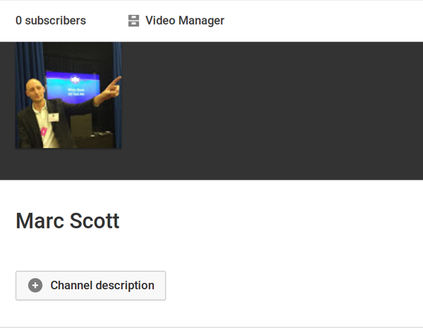
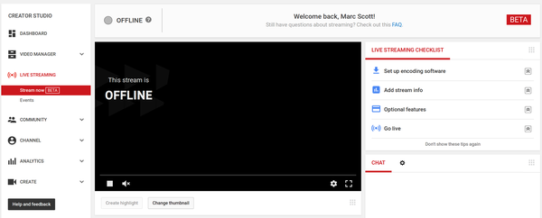

## YouTube-Setup

- Gehe zu [YouTube](https://www.youtube.com/) und melde dich an.
- Auf der linken Seite des Bildschirms sollte ein Menü mit der Option **Mein Kanal** angezeigt werden:

  

- In der Mitte des Bildschirms sollte die Option **Video Manager** angezeigt werden:

  

- Im Menü links sollte die Option **LIVE STREAMING** und darin die Option **Stream jetzt BETA** angezeigt werden:

  

- Scrolle zum Ende der Seite, dort solltest du die **ENCODER SETUP** Option sehen:

  

- Innerhalb des **ENCODER SETUP** gibt es die **Server-URL** und den **Stream-Namen/ Schlüssel**. Der Schlüssel scheint nur eine Reihe von Sternchen zu sein, bis du auf den **Anzeigen** Button klickst. Du musst den Schlüssel jedoch geheim halten, stelle also sicher, dass du ihn nicht online teilst.

