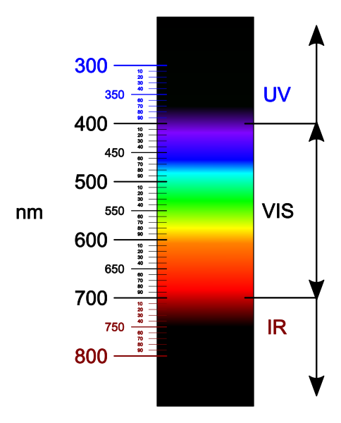
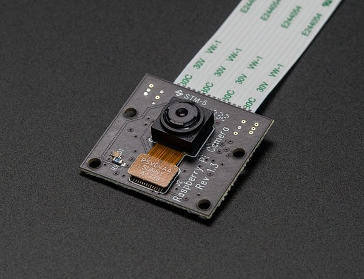

## Warum die Pi NoIR benutzen?

Gartenvögel sind sehr wählerisch, wo sie ihr Nest bauen. Um gute Ergebnisse zu erzielen, muss sich der Nistkasten außerhalb der Reichweite von Raubtieren, von der vorherrschenden Windrichtung abgewandt und nicht in der Nähe eines Vogel-Futterplatzes oder Vogel-Futterhauses befinden.

Sobald die Vögel eingezogen sind, dürfen sie bis zur Beendigung der Aufzucht nicht gestört werden. Deshalb sollte der Nistkasten in Deutschland, Österreich und der Schweiz bereits im Spätsommer oder anfangs Herbst aufgestellt werden. Wenn mit dem Projekt etwas schiefgeht, kannst du die Box nicht einfach öffnen und an den Drähten herumspielen oder die Kamera einstellen, da dies die Vögel traumatisiert und dazu führen kann, dass die Eier oder Jungtiere ausgesetzt werden.

Eine Anforderung an das System ist, die Vögel in völliger Dunkelheit sehen zu können. Ein Licht in der Vogelbox könnte Insekten und Raubtiere anziehen, daher würde kein Vogel diesen Nistplatz auswählen. Es ist jedoch möglich, das Innere der Vogelbox mit einer Art Licht zu beleuchten, das für Tiere und Menschen unsichtbar, für eine Kamera jedoch sichtbar ist. Dies ist allgemein als Nachtsicht bekannt. Nachtsicht funktioniert mit einem Lichtspektrum namens [Infrarot](http://en.wikipedia.org/wiki/Infrared). Dieses hat eine längere Wellenlänge als sichtbares Licht. Beachte, dass die IR-Wellenlängen in diesem Diagramm unterhalb des sichtbaren Lichtspektrums (VIS) angezeigt werden:

*Bild von [Wikimedia Commons](https://commons.wikimedia.org/wiki/File:Light_spectrum_(precise_colors).svg).*

Viele Geräte verfügen über eine Nachtsichtfähigkeit, da sie das Infrarotspektrum wahrnehmen. In einer Nachtsicht-Überwachungskamera sind typischerweise viele Infrarot-LEDs (Leuchtdioden) um das Objektiv herum eingebaut. Diese senden Infrarotlicht aus, das dann von verschiedenen Objekten reflektiert wird und zum Kameraobjektiv zurückkehrt, sodass ein Bild aufgenommen werden kann. Das Bild sieht schwarzweiß (Graustufen) aus, da keine Wellenlängen des Lichts aus dem sichtbaren Spektrum erfasst werden. Ein Schwarzweißbild ist jedoch gut genug um zu beobachten, was in einem Nistkasten passiert und es stört oder beeinträchtigt die Vögel in keiner Weise.

Oben abgebildet ist die spezielle Version des Raspberry Pi-Kameramoduls namens Pi NoIR. Es ist im Wesentlichen identisch mit der normalen Kamera, hat jedoch keinen Infrarotfilter, was bedeutet, dass es Infrarotlicht einlässt. Diese Kamera bietet in Kombination mit einer Infrarotlichtquelle Nachtsicht. Es ist auch klein und nicht zu aufdringlich, wenn es an der Innenseite einer Vogelbox montiert wird.

