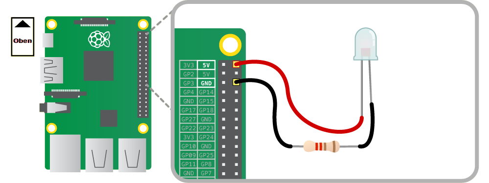

## Verkabelung der Infrarot-LED

Es ist beabsichtigt, dass eine einzige Infrarot-LED das Innere des Nistkastens beleuchtet, damit die Pi NoIR-Kamera etwas sehen kann. Die 890-nm-IR-LED ist ein identisches Bauteil, wie es in TV-Fernbedienungen verbaut wird. Der einzige Unterschied ist, dass sie ständig eingeschaltet bleiben muss, um den Live-Stream zu ermöglichen.

Du solltest die LED bei ausgeschaltetem Raspberry Pi verkabeln. Aus Sicherheitsgründen trenne ihn vom Stromnetz. Verwende den folgenden Befehl, um den Pi herunterzufahren:

```bash
sudo halt
```

Warte, bis die ACT (Aktivitäts) -LED nicht mehr blinkt, bevor du das Gerät ausschaltest.

Wenn du zuvor eine LED an die Pi-GPIO-Pins angeschlossen hast, beachte bitte, dass diese LED etwas anders ausgeführt werden muss. Eine Infrarot-LED benötigt mehr Strom, als die GPIO-Pins liefern können. Sie muss direkt an die 5-Volt-Versorgung des Raspberry Pi, mit einem 220-Ohm Widerstand in Serie geschaltet, angeschlossen werden. Ohne den Widerstand ist der Strom zu hoch und die LED brennt nach etwa zehn Sekunden durch.

Das folgende Diagramm zeigt, wie die LED verkabelt werden soll. Du wirst feststellen, dass die LED zwei Beine hat, eines etwas länger als das andere. Das längere der beiden wird als **Anode** bezeichnet und das kürzere ist die **Kathode**. Die LED benötigt Strom, der in die Anode hinein und aus der Kathode heraus fließt. Wenn du die Polarität vertauschst, passiert nichts.

Verwende die Buchse-Buchse-Verbindungskabel, um die folgenden Verbindungen herzustellen:

- Verbinde die Anode mit 5 Volt. Dies ist der erste Pin in der äußeren Reihe des Pi
- Verbinde die Kathode mit dem 220-Ohm-Widerstand
- Verbinde die andere Seite des Widerstands mit Masse. Dies ist der dritte Pin in der äußeren Reihe des Pi

Dadurch kann Strom vom Pi in die LED und über den Widerstand zurück zur Erde fließen. Der Widerstand begrenzt den Strom auf ca. 23 mA, damit die LED nicht durchbrennt.



Schalte anschließend den Raspberry Pi wieder ein und melde dich wie gewohnt an. Du wirst schnell feststellen, dass die LED nicht funktioniert, aber tatsächlich funktioniert sie. Deine Augen können es nicht sehen, aber die Pi NoIR-Kamera kann es. Schalte die Kameravorschau mit diesem Befehl ein:

```bash
raspivid -t 0
```

Halte die LED vor die Kamera und es sieht folgendermaßen aus:


Wenn die LED immernoch nicht leuchtet, hast du möglicherweise die Polarität von Anode und Kathode vertauscht. Überprüfe deine Verkabelung anhand des obigen Diagramms. Versuche, das Licht auszuschalten und die LED auf dich selbst zu richten. Schau jedoch nicht direkt hinein, da Infrarotlicht deine Augen immernoch schädigen kann. Du wirst anhand der Vorschau der Pi NoIR-Kamera sehen, dass sie dich recht gut beleuchtet.

Drücke `Strg +C` wenn du die Vorschau beenden möchtest.

