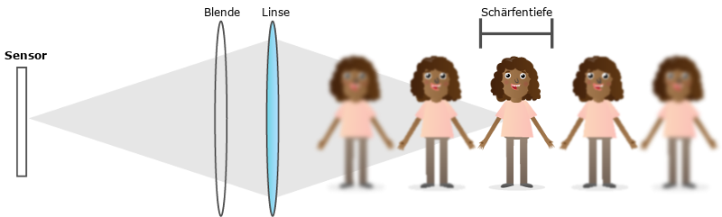
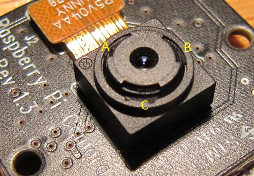
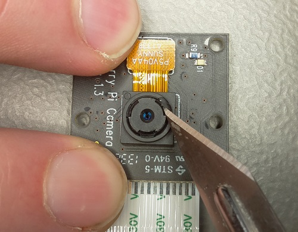
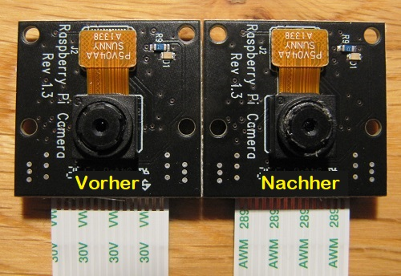

## Anpassen des Kamerafokus

Nistkästen sind in der Regel recht klein. Aus diesem Grund musst du wahrscheinlich die Brennweite der Pi NoIR-Kamera verringern, da sonst nur verschwommene Bilder von Vögeln angezeigt werden. Dies hängt von dem von dir ausgewählten Nistkasten ab. Wenn du jedoch den von uns vorgeschlagenen [Gardman](http://www.diy.com/nav/garden/pet-bird-care/bird-care/nesting_boxes/Gardman-Wild-Bird-Nest-Box-9374965) verwendest (der auch vom [British Trust for Ornithology](http://www.bto.org/) empfohlen wird), musst du auf jeden Fall den Kamerafokus einstellen.



Die Brennweite der Kamera ist der Abstand von der Vorderseite des Objektivs zum nächstliegenden fokussierten Objekt. Die Schärfentiefe ist der Bereich, in dem Objekte im Fokus erscheinen.

Das Pi-Kameramodul hat eine Brennweite von ca. 50 cm und eine Schärfentiefe von 50 cm bis unendlich. Dies bedeutet, dass Objekte nur dann scharf erscheinen, wenn sie mindestens 50 cm vom Objektiv der Kamera entfernt sind. Wenn Objekte näher sind, sind sie verschwommen und unscharf. Der Gardman-Nistkasten ist innen ca. 18 cm hoch. Daher wissen wir, dass alle Objekte 18 cm entfernt oder näher sind, wenn die Kamera an der Innenseite des Daches befestigt ist. Wenn wir möchten, dass sie scharfgestellt sind, muss die Brennweite der Kamera reduziert werden.

Versuche als Experiment, einige Schlüssel in den Nistkasten zu legen, halte die Kamera bei geöffnetem Dach (entferne die Schraube) auf ungefähre Dachhöhe und sieh dir die Kameravorschau an. Die Schlüssel werden wahrscheinlich nicht scharfgestellt. Verwende den folgenden Befehl, um die Kameravorschau zu starten:

```bash
raspivid -t 0
```

Drücke **Strg + C** wenn du die Vorschau beenden möchtest.

Die Raspberry Pi NoIR-Kamera verfügt über ein Objektiv, das sich drehen lässt, um den Fokus anzupassen. Es wird als Kamera mit festem Fokus verkauft, wird jedoch mit drei Klebestellen geliefert, um das drehbare Objektiv an Ort und Stelle zu halten. Schau dir das Bild unten an: die Buchstaben **A**, **B** und **C** markieren die Position des Klebers:



Um den Focus einzustellen, muss das Objektiv gedreht werden. Dafür musst du die Klebertropfen manuell entfernen. Dies ist einfacher, als es sich anhört und dauert nur etwa fünf Minuten. Du benötigst ein scharfes Werkzeug, etwa eine Nadel, ein Skalpell oder einen Zahnstocher. Die Arbeit unter einem Mikroskop mit geringer Leistung kann ebenfalls sehr hilfreich sein. Du solltest die Kamera dabei vollständig vom Raspberry Pi trennen.



Achte darauf, dir nicht in die Finger zu schneiden. Kinder sollten dies aus Sicherheitsgründen nur unter Aufsicht von Erwachsenen tun, insbesondere, wenn ein Skalpell verwendet wird. Der orangefarbene Anschluss mit dem Aufdruck **SUNNY** kann herausspringen, wenn du den Kleber abkratzt. Mach dir aber keine Sorgen, denn er springt ohne Probleme wieder zurück. Es ist unwahrscheinlich, dass du die Kamera beschädigst, es sei denn, du bist sehr ungeschickt. Wenn sie jedoch kaputt geht, bist du selbst verantwortlich.

Die Kamera sieht nach dem Entfernen des Klebers etwas unsauber aus, aber das spielt keine Rolle, da sie sich im Inneren des Nistkastens befindet und niemand das sehen kann. Siehe unten für einen Vergleich:



Wenn du den gesamten Kleber zu deiner Zufriedenheit entfernt hast, verwende eine Pinzette oder eine Schmuckzange, um den inneren Teil der Kamera wie unten gezeigt zu greifen. Du solltest ihn dann drehen können. Dreh ihn vorsichtig einige Male **gegen den Uhrzeigersinn**. Schließe die Kamera nun wieder an den Raspberry Pi an und überprüfe, wie die Schlüssel aussehen.

Möglicherweise möchtest du an dieser Stelle etwas unter die Schlüssel legen, um die Höhe eines Nestes zu simulieren und um sicherzustellen, dass die Vögel im Fokus sind. Denke daran, dass du nach dem Einzug der Vögel den Nistkasten nicht mehr öffnen kannst um die Kamera einzustellen, falls der Fokus falsch ist.


Achte darauf, das Objektiv nicht zu weit zu drehen, da es sonst herausspringt und es etwas schwierig sein kann, es wieder einzuschrauben. In diesem Fall setze es einfach wieder vorsichtig ein und dreh es im Uhrzeigersinn, bis es einrastet. Sobald der gewünschte Fokus gefunden wurde, musst du die Kamera nicht mehr neu verkleben. Sie bewegt sich nicht von allein, selbst wenn sie ein paar Stöße und Schläge abbekommt.

