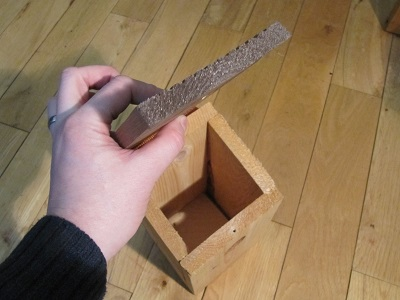
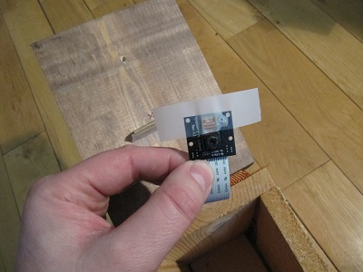
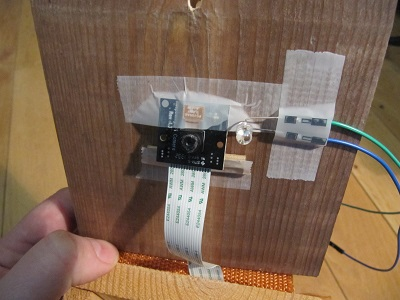

## Installation der Kamera und der LED im Nistkasten

In diesem Teil der Anleitung zeigen wir dir, wie du die Kamera installierst. Es liegt dann an dir, eine dauerhaftere Lösung zu finden, was an sich schon Spaß macht.

Die folgenden Anweisungen gelten für den [Gardman](http://www.diy.com/nav/garden/pet-bird-care/bird-care/nesting_boxes/Gardman-Wild-Bird-Nest-Box-9374965) Nistkasten.

- Lege deinen Finger auf das Dach, ungefähr über der Mitte des Grundkörpers des Nistkastens:

    

- Nimm das Dach ab und lege deinen Daumen direkt unter deinen Finger, sodass du den Deckel wie gezeigt einklemmst:

    

- Dein Daumen ist jetzt dort, wo die Kamera sein muss. Nimm einen Stift und markiere diese Stelle mit einem Kreuz:

    

- Schneide ein Rechteck aus Pappe (ca. 4 cm x 2 cm) aus und falte es der Länge nach in zwei Hälften. Befestige es mit Klebeband an der Unterseite des Daches, sodass es sich einige Millimeter unter dem Kreuz befindet. Damit soll der Dachwinkel ausgeglichen werden, sodass die Kamera direkt in die Mitte des Nistkastens zeigt.

    

- Nimm als Nächstes die Pi NoIR und schiebe das Flachbandkabel zwischen dem Dachscharnier und der Rückwand des Kastens nach unten. Dabei müssen die Kontakte von der Rückwand weg zeigen. Wenn du möchtest, kannst du die beiden mittleren Heftklammern entfernen, mit denen das Scharnier befestigt ist. Dadurch verlässt das Flachbandkabel den Nistkasten ordentlicher.

    

- Nimm etwas Klebeband und klebe es wie gezeigt über die Pi NoIR. Verdecke **nicht** das Kameraobjektiv.

    

- Befestige die Kamera so, dass sich die Mitte des Objektivs direkt über dem Kreuz befindet, das du zuvor gezeichnet hast. Die Kamera sollte in einem Winkel angebracht sein.

    

- Schließe den Deckel und überprüfe den Kamerawinkel von der Seite: die Kamera muss direkt auf die Mitte des Kastens zeigen. Wenn es nicht richtig aussieht, geh zurück und passe sie erneut an, bis du zufrieden bist.

    

- Befestige die Infrarot-LED an der Unterseite des Daches. Befestige sie nicht zu nahe an der Kamera, da sonst die Kamera stark geblendet wird. Die LED kann überall eingebaut werden, hilfreich ist es, die Beine wie gezeigt um 90 Grad zu biegen und sie auf diese Weise am Dach zu befestigen. Möglicherweise möchtest du auch das Ende der LED mit Korrekturflüssigkeit abdunkeln oder durch Abfeilen mit einer Nagelfeile abblenden. Dadurch wird ein Scheinwerfereffekt auf das Video verhindert und ein diffuseres Licht erzeugt.

    

- Schließe nun den Raspberry Pi wieder an und teste den Fokus erneut. Wir empfehlen, zuerst das Flachbandkabel der Kamera von der Rückseite des Nistkastens an den Pi anzuschließen. Schließ dann die LED und den Widerstand an gefolgt von Bildschirm, Tastatur und schließlich der Stromversorgung. Wenn du den Aufbau testest, kann es hilfreich sein, den Raspberry Pi verkehrt herum auf dem Dach des Nistkastens abzulegen, aber mach es so, wie es für dich am besten funktioniert.

- Boote den Pi, melde dich wie gewohnt an und starte dann die Videovorschau mit `raspivid -t 0`. Bei geschlossenem Dach des Nistkastens solltest du das Innere in Schwarzweiß sehen können. Dies zeigt, dass die Infrarotbeleuchtung funktioniert; du solltest sogar in der Lage sein, das Loch abzudecken und trotzdem das Innere zu sehen. Es sieht ähnlich aus wie auf dem Bild unten, wird jedoch etwas vergrößert. Dies liegt daran, dass dieses Bild mit dem Befehl `raspistill` aufgenommen wurde und nicht mit `raspivid`. Wenn du überhaupt nichts sehen kannst, ist die LED wahrscheinlich nicht richtig verdrahtet: überprüfe die Verdrahtung und die Polarität von Anode und Kathode.

    

- Es ist jetzt hilfreich, ein Objekt mit Schwarz-Weiß-Text in die Vogelbox zu legen, um den Fokus zu überprüfen. Ein gutes Objekt wäre eine Uhr oder eine Visitenkarte. Stelle sicher, dass der Text scharf und lesbar ist. Passe den Kamerafokus nach Bedarf erneut an, bevor du fortfährst. Denk daran, die Nesthöhe auszugleichen.

    Drücke **Strg + C** wenn du die Vorschau beenden möchtest.

- Betrachte zum Schluss die rote LED an der Kamera. Standardmäßig wird sie eingeschaltet, wenn die Kamera eingeschaltet ist. Dies ist eine große Abschreckung für einziehende Vögel, daher solltest du sie deaktivieren. Dies kann durch Bearbeiten der Raspberry Pi-Konfigurationsdatei erfolgen. Gib den folgenden Befehl ein:

    ```bash
    sudo nano /boot/config.txt
    ```

    Füge am Ende der Datei die folgende Zeile hinzu:

    ```bash
    disable_camera_led=1
    ```

    Drücke **Strg + O** zum Speichern und **Strg + X** zum Beenden. Die Änderungen werden erst nach einem Neustart wirksam:

    ```bash
    sudo reboot
    ```

