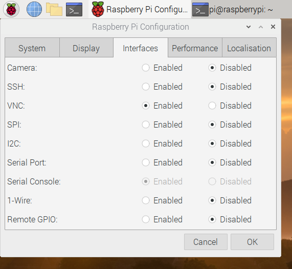
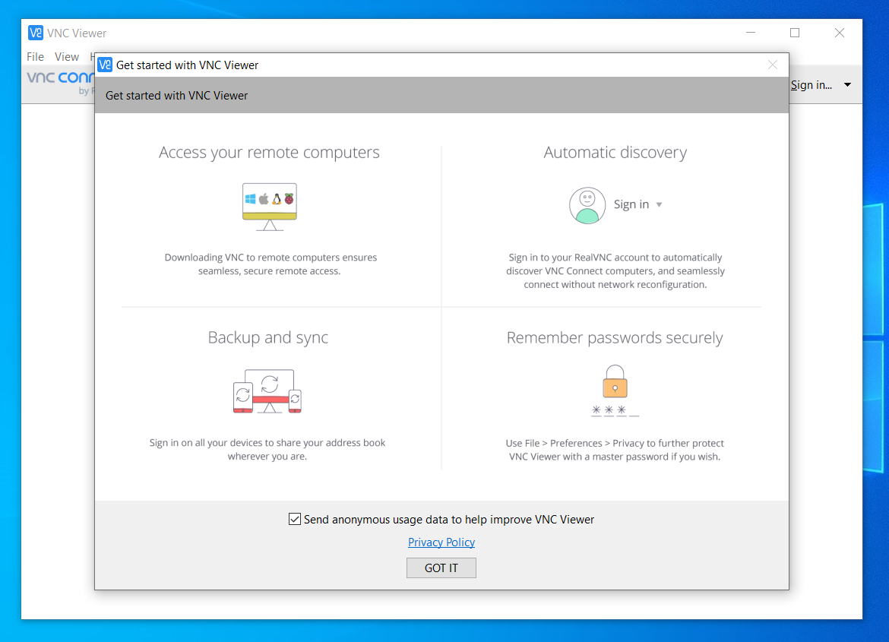

## VNC on the Raspberry Pi

This step will look at how to use VNC from a Windows, MacOS, or Linux computer, or a device running Android or iOS.

### VNC Raspberry Pi set-up

As VNC (or Virtual Network Computing) can potentially be a security risk, especially on open networks, it is not enabled by default. Before you enable VNC, you should make sure that you have permission from whoever looks after your network. They should make sure that the network router has an enabled firewall, a secure password and that any wireless connections are using WPA2.

To enable VNC, open the **Raspberry Pi Configuration** menu from the Preferences option in the main menu, and set VNC to **Enabled**.

Click on the **OK** button, and a new VNC icon should appear in the top right-hand corner of the screen. Click on this to open up **VNC Connect**. This window will provide some important information on your Raspberry Pi, including the IP (Internet Protocol) address. This will probably be something similar to `192.168.1.xxx`, where xxx is replaced by a number from 0 to 255.

Now that VNC is enabled, you can connect to your Raspberry Pi using another device that has VNC Viewer software running on it.

### VNC Viewer installation and set-up for Windows, Linux, or MacOS

Switch to the device that you want to use to remotely access your Raspberry Pi. The screenshots in this section are from computers running Windows 10 and MacOS Mojave, but the process is very similar for other operating systems.

1. Go to the [VNC Connect downloads page](http://rpf.io/vnc-viewer) and download the VNC Viewer for your operating system.
2. Install the application once it has downloaded. You may need to allow the installation of untrusted software for your OS.
3. Open the VNC Viewer and dismiss any opening message you receive.

   

4. Enter the IP address of your Raspberry Pi (the address you found in VNC Connect) into the bar at the top.

   

5. A warning dialog box will appear. Check that the **Signature** and **Catchphrase** shown are the same as those displayed on the VNC Connect application on your Raspberry Pi, to ensure you are connecting to the correct device. If they are, click on **Continue**.

   

6. Enter your Raspberry Pi username and password into the fields provided and click on **OK**.

   

7. You should now see the Raspberry Pi Desktop in a window. You can use your keyboard and mouse to control your Raspberry Pi. Everything inside the window is remotely controlling your Raspberry Pi. Click outside the window to use your Windows or Mac as normal.

   

### Android and iOS

You can find the [RealVNC Viewer for Android](https://play.google.com/store/apps/details?id=com.realvnc.viewer.android&hl=en_GB) in the Google Play store and the [RealVNC Viewer for iOS in the Apple App Store](https://apps.apple.com/us/app/vnc-viewer/id352019548).

Install the app, open it, and click on the `+` icon to add the Raspberry Pi that you wish to connect to. You'll have to enter the IP address of your Raspberry Pi, check the signature and catchphrase, and sign in to your user account in much the same way as was shown for Windows, Mac OS and Linux.

The touchscreen works to move a mouse cursor around the screen, and tapping the screen works as a mouse left-click. For other options and information on using special keys, check the help included in the app.

