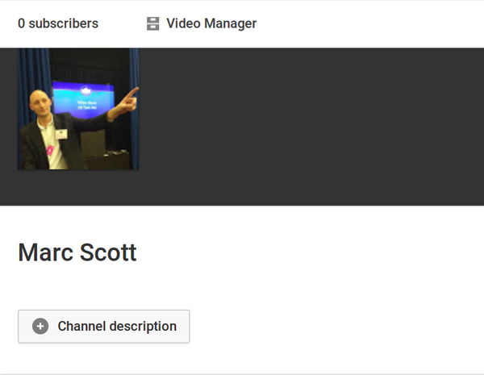
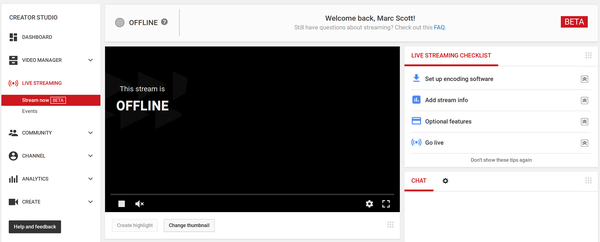
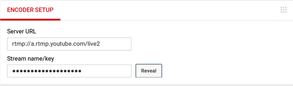

## YouTube Setup

- Go to [YouTube](https://www.youtube.com/), and sign in.
- On the left-hand side of the screen you should see a menu with the **My Channel** option available:

  

- In the middle of the screen you should see the **Video Manager** option:

  

- In the menu on the left you should see a **LIVE STREAMING** option, and within that a **Stream now BETA** option:

  

- Scroll down to the bottom of the page, and you should see the **ENCODER SETUP** option:

  

- Within the the **ENCODER SETUP** there is a **Server URL** and a **Stream name/key**. The key will appear to be just a line of asterisks, until you click on the **Reveal** button. You need to keep the key secret, though, so make sure you don't share it online.

