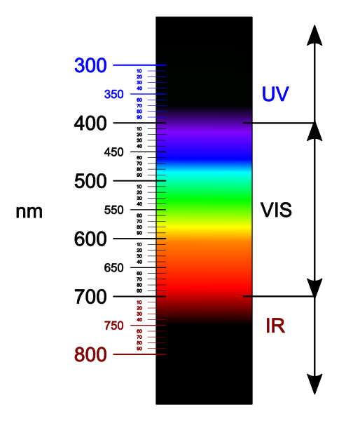
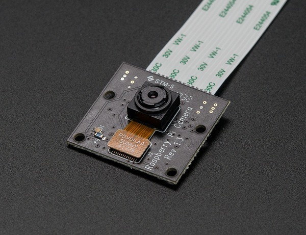

## Why use the Pi NoIR?

Garden birds are very choosy about where they build their nest. In order to get good results from this activity, the bird box will need to be located out of the reach of predators, away from any prevailing winds, and nowhere near a bird table or feeder.

Once birds have moved in, the box must not be disturbed until they have finished breeding; this is usually between October and January in the UK. If something goes wrong with the project, you can't simply open the box and fiddle with your wires or adjust the camera, as this will traumatise the birds and could cause eggs or hatchlings to be abandoned.

A requirement of the system is to be able to see the birds in total darkness. A light inside the bird box could attract insects and predators, and therefore no birds would select it as a nesting site. It's possible, however, to illuminate the inside of the bird box with a kind of light that's invisible to animals and humans, but is visible to a camera. This is commonly known as night vision. Night vision works by using a spectrum of light called [infrared](http://en.wikipedia.org/wiki/Infrared) which has a longer wavelength than visible light. Notice that IR wavelengths are shown below the visible spectrum of light (VIS) in this diagram:

*Image from [Wikimedia Commons](https://commons.wikimedia.org/wiki/File:Light_spectrum_(precise_colors).svg).*

Many devices incorporate night vision via the infrared spectrum. A night vision surveillance camera, for example, typically has lots of infrared LEDs (light-emitting diodes) built into it around the lens. These emit infrared light which will then bounce off various objects and return to the camera lens, allowing it to create an image. The image will look black and white (greyscale), because there are no wavelengths of light from the visible spectrum being detected. However, a black and white image is good enough to allow you to watch what's happening inside a bird box, and it doesn't disturb or interfere with the birds in any way.

Pictured above is the special version of the Raspberry Pi Camera Module called Pi NoIR. It's essentially identical to the normal camera but it has no infrared filter, meaning that it lets in infrared light. This camera, combined with an infrared light source, will give you night vision. It's also small and won't be too intrusive when mounted on the inside of a bird box.

