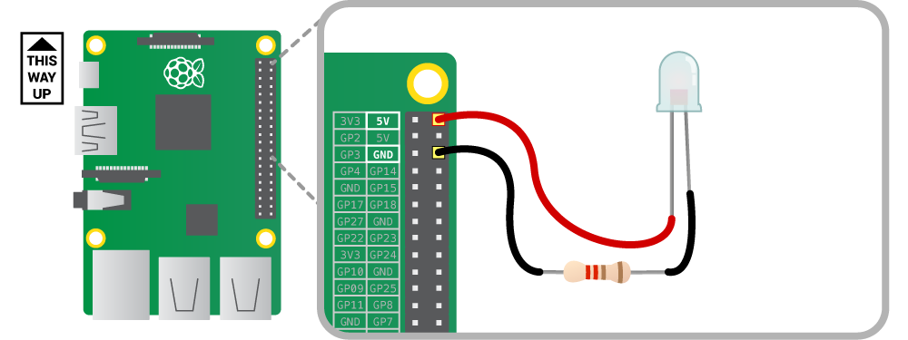
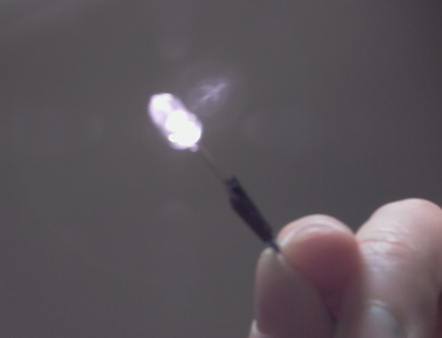

## Wiring up the infrared LED

The intention is to have a single infrared LED illuminating the inside of the bird box, to allow the Pi NoIR camera to see something. The 890nm IR LED is an identical component to the ones found inside TV remote controls. The only difference is that we're going to keep it on constantly to help the live stream.

You should wire the LED up with the Raspberry Pi turned off and unplugged from the mains for safety. Use the following command to shut down the Pi:

```bash
sudo halt
```

Wait for the ACT (activity) LED to stop blinking before turning off the power.

If you've wired up an LED to the Pi GPIO pins before, then please note that this LED needs to be done slightly differently. An infrared LED requires more current than the GPIO pins can provide. It needs to be connected directly to the 5 volt supply of the Raspberry Pi with a 220 ohm resistor inline; without the resistor the current will be too high, and the LED will burn out after about ten seconds.

The diagram below shows how the LED should be wired up. You'll notice that the LED has two legs, one slightly longer than the other. The longer of the two is called the **anode** and the shorter is the **cathode**. The LED needs power to flow into the anode and out of the cathode; if you get the polarity wrong then nothing will happen.

Use the female-to-female jumper wires to make the following connections:

- Connect the anode to 5 volts, which is the first pin on the outside row on the Pi
- Connect the cathode to the 220 ohm resistor
- Connect the other side of the resistor to ground, which is the third pin in on the outside row on the Pi

This will allow power to flow from the Pi into the LED and back to ground through the resistor. The resistor will limit the current to about 23 mA so that the LED doesn't burn out.



Next, turn the Raspberry Pi back on and log in as usual. You'll quickly notice that the LED doesn't appear to be working, but in fact it is. Your human eyes can't see it, but the Pi NoIR camera can. Turn on the camera preview with this command:

```bash
raspivid -t 0
```

Hold the LED in front of the camera and it will look like this:



If the LED still doesn't appear to be lit, then you may have mixed up the polarity of the anode and cathode. Double-check your wiring against the diagram above. Try turning out the lights and aiming the LED at yourself; don't look directly into it, however, as infrared light can still cause harm to your eyes. You'll see from the Pi NoIR camera preview that it will illuminate you quite well.

Press `Ctrl + C` when you want to exit.

