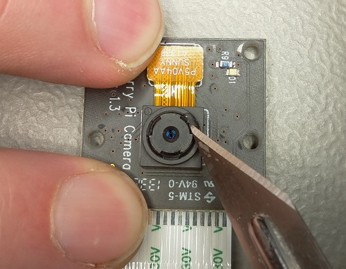

## Adjusting the camera focus

Bird boxes tend to be quite small, and because of this you'll probably need to reduce the focal length on the Pi NoIR camera, otherwise you're only going to see blurry images of birds. It will depend on the bird box you have chosen; however, if you're using the [Gardman](http://www.diy.com/nav/garden/pet-bird-care/bird-care/nesting_boxes/Gardman-Wild-Bird-Nest-Box-9374965) box suggested by this guide (which is also recommended by the [British Trust for Ornithology](http://www.bto.org/)), then you will definitely have to adjust the camera focus.


The focal length of the camera is the distance from the front of the lens to the closest object which is in focus. The depth of field is the range within which objects appear to be in focus.

The Pi Camera Module has a focal length of about 50 cm and a depth of field of 50 cm to infinity. This means that objects will only appear in focus if they’re at least 50 cm away from the lens of the camera. If objects are closer, then they will be blurry and out of focus. The Gardman bird box is about 18 cm high on the inside; therefore we know that if the camera is stuck to the inside of the roof, all objects are going to be 18 cm or closer. If we want them to be in focus, then the camera focal length will need to be reduced.

As an experiment, try putting some keys into the bird box and, with the roof open (remove the screw), hold the camera at the approximate height of the roof and look at the camera preview. The keys will probably not be in focus. Use the following command to start the camera preview:

```bash
raspivid -t 0
```

Press **Ctrl + C** when you want to exit.

The Raspberry Pi NoIR camera has a lens that can rotate to adjust the focus. It's sold as a fixed-focus camera, but it ships with three blobs of glue to hold the rotatable lens in place. Look at the image below: the letters **A**, **B**, and **C** mark the location of the glue:


To be able to rotate the lens to adjust the focus, you'll need to dig out these blobs of glue manually. This is easier than it sounds and only takes about five minutes. You will need a sharp tool like a needle, a scalpel or a dental pick. Doing the work under a low power microscope can also help a lot. You should completely disconnect the camera from the Raspberry Pi when you do this.



Take care not to cut your fingers. Children should only do this under adult supervision for safety, especially if a scalpel is being used. The orange connector with the word **SUNNY** printed on it can pop out when you're scraping the glue away; don’t worry, though, because it pops right back in without any problems. Unless you’re very heavy-handed, it’s unlikely that you will break the camera; if it does break, though, it’s your own responsibility.

The camera will end up looking a little scruffy after you have removed the glue, but it doesn't really matter since it's going to live on the inside of a bird box without anyone looking at it. See below for a comparison:


Once you're satisfied that you have removed all of the glue, use a pair of tweezers or jewellery pliers to grip the inner section of the camera as shown below; you should then be able to turn it. Carefully rotate it **anti-clockwise** a few times. Now reconnect the camera to the Raspberry Pi and check to see how the keys look.

You may wish to put something under the keys at this point to simulate the height of a nest, to make doubly sure that the birds will be in focus. Remember that once birds move in, you can't come back and adjust the camera if the focus is wrong.


Be careful not to rotate the lens too far, otherwise it will pop out, and it can be a bit tricky to get it back in and on the thread. If this does happen, just put it back in gently and rotate clockwise until it catches. Once the required focus has been found, you don't need to re-glue it. It won't move on its own, even if it gets a few bumps and knocks.

