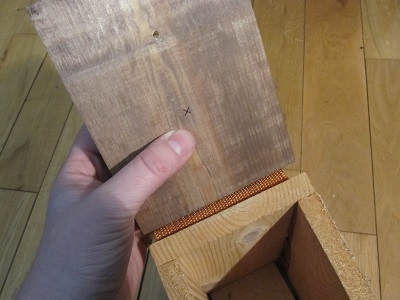
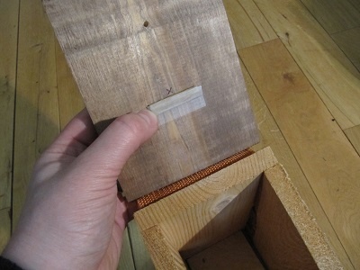

## Installing the camera and LED into the bird box

In this part of the guide, we will demonstrate how to install the camera; it will then be up to you to come up with a more permanent solution, which is a fun activity in itself.

The following instructions are for the [Gardman](http://www.diy.com/nav/garden/pet-bird-care/bird-care/nesting_boxes/Gardman-Wild-Bird-Nest-Box-9374965) bird box.

- Place your finger on the roof, approximately above the centre of the main body of the bird box:

    

- Lift up the roof and place your thumb directly below your finger, so that you're pinching the lid as shown:

    

- Your thumb is now where the camera needs to be. Take a pen and mark this spot with a cross:

    

- Cut out a rectangle of cardboard approximately 4 cm x 2 cm (1.5" x 0.75") and fold it in half lengthways. Use some tape to secure it to the underside of the roof so that it's a few millimetres below the cross. This is going to be used to compensate for the angle of the roof, so that the camera points directly into the middle of the bird box.

    

- Next, take the Pi NoIR and slide the flex down between the roof hinge and the back wall of the box. Do this with the tin connectors facing away from the back wall. If you wish, you can remove the two middle staples holding the hinge in place; this will make the flex exit the bird box more neatly.

    

- Take some tape and put it across the top of the Pi NoIR as shown. Do **not** cover the camera lens.

    

- Secure the camera in place so that the central lens is directly over the cross that you drew earlier. The camera should sit at an angle.

    

- Close the lid and inspect the camera angle from the side: it needs to point directly at the centre of the base. If it doesn't look right, then go back and adjust it until you're happy.

    

- Secure the infrared LED to the underside of the roof. Don't attach it too close to the camera, or you'll see a lot of glare on the video. The LED can go anywhere, but it can help to bend its legs by 90 degrees as shown and secure it to the roof that way. You may also wish to blank off the end of the LED with correction fluid or by filing it down with a nail file. This will prevent any spotlight effect on the video and give a more diffuse light.

    

- Now reconnect the Raspberry Pi and test the focus once again. We recommend connecting the camera flex coming from the back of the bird box to the Pi first. Then connect the LED and resistor, followed by the screen, keyboard, and finally the power supply. When testing this setup, it can be helpful to rest the Raspberry Pi upside down on the roof of the bird box, but do whatever works best for you.

- Boot up, log in as usual and then start the video preview with `raspivid -t 0`. With the roof of the bird box closed, you should be able to see the inside in black and white. This shows that the infrared illumination is working; you should even be able to cover the hole and still see the inside. It will look similar to the picture below but will be slightly more zoomed in. This is because this image was taken using the `raspistill` command and not `raspivid`. If you can't see anything at all, then it's likely the LED is not wired up correctly: double-check the wiring and the polarity of the anode and cathode.

    

- It's now helpful to put an object with some black-on-white text into the bird box to verify the focus; a good object to use would be a watch or a business card. Ensure that the text is in focus and readable; adjust the camera focus again as necessary before continuing. Remember to compensate for the nest height.

    Press **Ctrl + C** when you want to stop the camera preview.

- Lastly, consider the red LED on the camera. By default, it comes on whenever the camera is on. This will be a huge deterrent to birds moving in, so you should disable it. This can be done by editing the Raspberry Pi configuration file. Enter the command below:

    ```bash
    sudo nano /boot/config.txt
    ```

    Add the following line to the end of the file:

    ```bash
    disable_camera_led=1
    ```

    Press **Ctrl + O** to save and **Ctrl + X** to quit. The changes will only take effect after a reboot:

    ```bash
    sudo reboot
    ```

